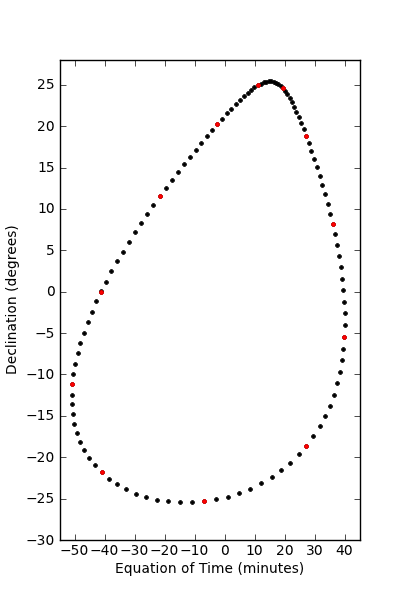

========================
Examples
========================

1. Plotting the Mars Analemma 
---

The Mars Anelemma shows the angular offset of the Sun from its mean position throughout the year. We can plot this by plotting the equation of time and the solar declination.

.. code-block :: python

	import Mars24
	import numpy
	#define the start date as sometime in May 2000, start of MY25
	start_j2000_ott = 151.27365 

	#create the calendar array with 120 points
	msd = numpy.linspace(0,669,120)
	
	#calculate the j2000 offset dates
	j2000_offsets = Mars24.j2000_from_Mars_Solar_Date(msd + Mars24.Mars_Solar_Date(start_j2000_ott))

	#calculate the equation of time in minutes and the declination.
	eot = Mars24.equation_of_time(j2000_offsets)*60/15. #convert from degrees to minutes
	dec = Mars24.solar_declination(Mars24.Mars_Ls(j2000_offsets)) #takes Ls, not MSD
	
Plotting ``eot`` against ``dec`` gives the following plot ('months' are also marked in red).

