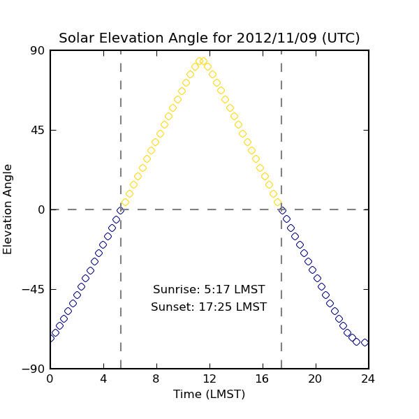

========================
Examples
========================

1. Plotting the Mars Analemma 
---------------------------------

The Mars Anelemma shows the angular offset of the Sun from its mean position throughout the year. We can plot this by plotting the equation of time and the solar declination.

.. code-block :: python

	import marstime
	import numpy
	#define the start date as sometime in May 2000, start of MY25
	start_j2000_ott = 151.27365 

	#create the calendar array with 120 points
	msd = numpy.linspace(0,669,120)
	
	#calculate the j2000 offset dates
	j2000_offsets = marstime.j2000_from_Mars_Solar_Date(msd + marstime.Mars_Solar_Date(start_j2000_ott))

	#calculate the equation of time in minutes and the declination.
	eot = marstime.equation_of_time(j2000_offsets)*60/15. #convert from degrees to minutes
	dec = marstime.solar_declination(marstime.Mars_Ls(j2000_offsets)) #takes Ls, not MSD
	
Plotting ``eot`` against ``dec`` gives the following plot ('months' are also marked in red).

.. figure:: analemma.png
	:align: center
	
2. Sunrise calculation
-------------------------
The sunrise and sunset times for a given date can be calculated relatively easily using the ``solar_elevation`` function in the library.
The only complication is that the _forward_ calculation (from elevation to time) is much harder to perform than the _reverse_ calculation
(time to elevation), so to calculate the times this example uses a bisect search to find the correct time.

The first step of the algorithm is finding the local midnight. For this we need to find the current time at our location on Mars. The first function simple_julian_offset calculates the Julian date offset from January 1, 2000 of the current date (and time).

.. code-block :: python

    def simple_julian_offset(indate):
        """Simple conversion from date to J2000 offset"""
        datetime_epoch = datetime.datetime(2000,1,1,12,0,0)
        date = indate-datetime_epoch
        jdate = date.days + date.seconds/86400.
        return jdate

The next step is then to calculate the local solar time and find the local midnight before and after this time, using the function ``Local_True_Solar_Time`` from the ``marstime`` package. If the local time is H hours, the local midnights occurs H hours before (it’s H o’clock after all) and 24-H hours later.

.. code-block :: python

    def midnight(date, longitude, latitude):
        """Given a Mars Solar Date(MSD) and location, find the local midnight times.
        The input data is used to calculate the local True solar time (LTST)
        and the local midnight occurs LTST hours before and 24-LTST after"""
        lt = marstime.Local_True_Solar_Time(longitude, date)
        mid1 = date - lt/24.
        mid2 = date + (24-lt)/24.
        return (mid1, mid2)

The next step is to calculate midday by taking the average of the two midnight times. Then we can run the bisect sort between midnight to midday to find the sunrise, and midday to midnight to find the sunset.

.. code-block :: python

    def solelev(date, x,y, solar_angular_radius=0.0):
        """a wrapper for scipy.optimize to reverse the arguments for solar_elevation"""
        return marstime.solar_elevation(x,y,date)+solar_angular_radius
 
.. code-block :: python

    def sunrise_sunset(date, longitude, latitude, solar_angular_radius=0.0):
        """Interface to the scipy.optimize.
        Using the date (j2000 offset) and location, start by finding the local
        midnights. the local mid-day is then (roughly) at the center of the two
        midnights. Sunrise must occur between midnight and midday, sunset between
        midday and midnight (except for polar night).
 
        This method uses Ian's method, which is less annoying than my method that required
        a conditional depending on whether 'date' was in the daytime or nighttime."""
 
        mid1,mid2=midnight(date, longitude, latitude)
        noon = 0.5*(mid1+mid2)
        sunrise = scipy.optimize.bisect(solelev, mid1, noon, args=(longitude, latitude, solar_angular_radius))
        sunset = scipy.optimize.bisect(solelev, noon, mid2, args=(longitude, latitude, solar_angular_radius))
        return sunrise, sunset

To make bisect work, I reversed the order of variables in the marstime.solar_elevation function so that it takes time first and location second. If we want the real sunrise time, when the top of the Sun is first seen then we calculate the angular radius of the sun and offset or solar elevation angle by this amount.

.. code-block :: python

    def sun_angular_radius(jdate, solar_radius = 6.96342e8, one_au=1.496e11):
        """Calculate the angular size of the sun at the specified date. Assumes that
        solar radius is 6.9e8m, one AU is 1.496e11m"""
        #as Google usefully says, solar_radius = 1 solar radius
        #wikipedia solar radius 6.96342x10^5 km
        # 1 Au 1.496x10^8 km
        orbit_radius = marstime.heliocentric_distance(jdate) #in AU.
        angular_radius = solar_radius / (orbit_radius * one_au)
        angular_radius_degree = numpy.rad2deg(angular_radius)
        return angular_radius_degree

This is all of the code needed to find local sunrise and sunset (except for a few package imports). Calling the code is as simple as

.. code-block :: python

    jdate = simple_julian_offset(datetime.datetime.now())
    sun_ang = sun_angular_radius(jdate)
    sunrise,sunset = sunrise_sunset(jdate, 360.-137.4,-4.5)
    
which will return the sunrise and sunset at Gale crater in hours as a floating point number.

Running this code today (November 9th, 2012) returns the sunrise/sunset time at Gale crater as 5:17 AM and 5:25 PM. 
The program `calculate_sunrise` in the `examples` directory of the package will perform this calculation and plot a 
figure of the solar elevation as a function of local time, as below:

